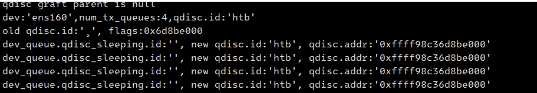
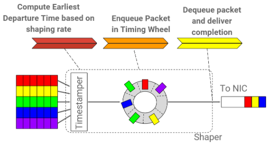
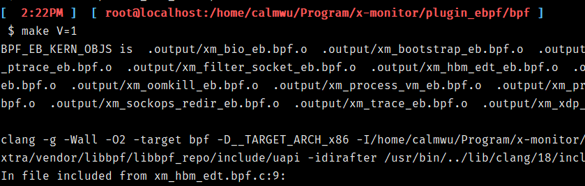
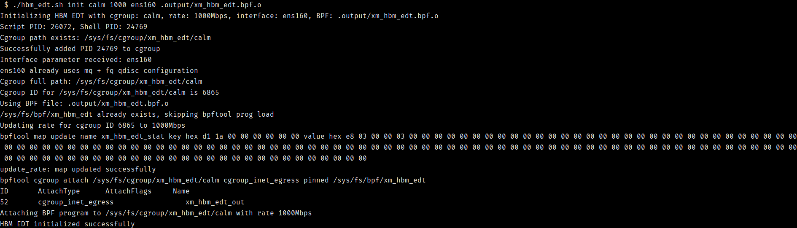
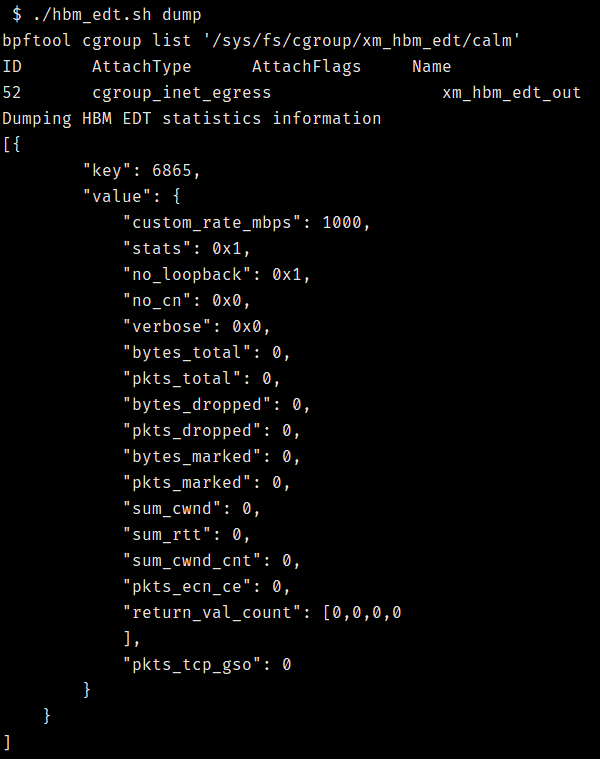
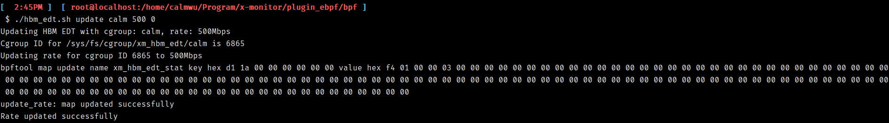
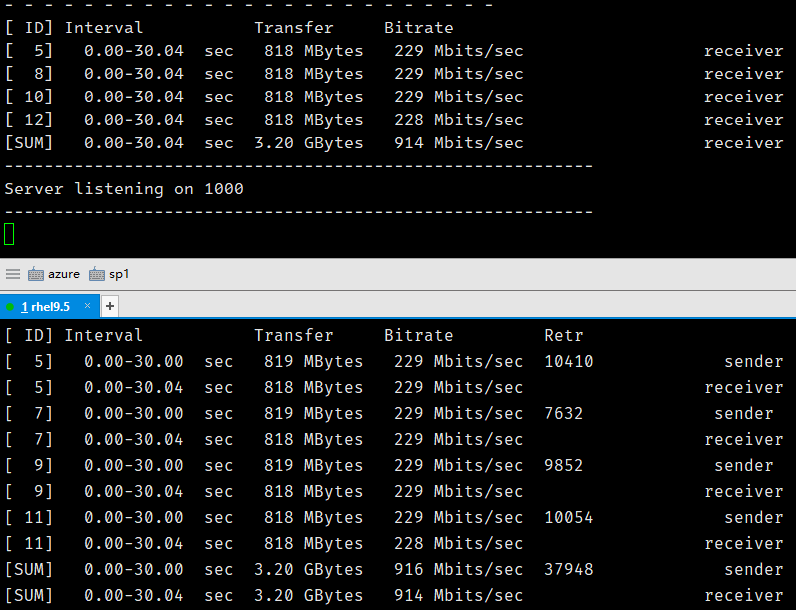
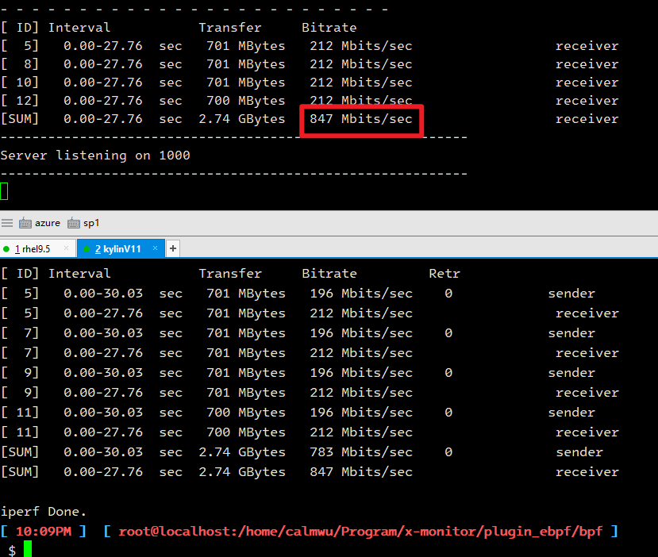

# eBPF EDT设置出口带宽

## 传统方案

​		在Linux中我们如果需要对一个服务（例如：redis）的出口带宽进行限制，一般会使用TC HTB来实现。但HTB对网卡的多队列支持不好，从下图可以看到，虽然HTB会创建4个软队列，但是4个软队列会共享同一个HTB策略，这样流控策略会在4个cpu上产生竞争。

​		HTB是全局共享的。

​		

​		如果使用mq Qdisc + HTB child Qdisc模式，那么就需要对应用发出的SKB做Qdisc软队列进行绑定。这个特性虽然可以使用eBPF的queue_mapping来实现，但实际使用，配置，运维起来十分的麻烦。

## EDT方案

​		EDT：Earliset Departure Time，核心是按用户设置的Rate bps给发送的skb打上发送时间戳，配合fq qdisc的timeing wheel scheduler来发包。



​		用eBPF来实现EDT有两种方式：

### eBPF cgroup_skb/egress

​		**在网络三层工作，使用eBPF cgroup_skb/egress Prog，hook点是BPF_CGROUP_INET_EGRESS**。这种方式的出处来自于内核源码samples/bpf/hbm_edt_kern.c，好处在于将应用和cgroup对应，配置方便。prog的返回值可以在感知拥塞的情况下启动ecn通知和cwnd的拥塞恢复。

### eBPF TC qdisc

​		**在网络二层工作，使用eBPF tc Prog，hook点是SCHED_CLS，需要使用tc qdisc add dev $dev clasct, 在添加filter**。这种方式被cillium使用，用来限制每个Pod的出口带宽。该Prog需要在逻辑中区别Pod的endpoint，针对不同的endpoint来使用不用的rate bps。

## 使用方式

​		本程序基于eBPF cgroup_skb/egress，源码：[x-monitor/plugin_ebpf/bpf/xm_hbm_edt.bpf.c at main · wubo0067/x-monitor](https://github.com/wubo0067/x-monitor/blob/main/plugin_ebpf/bpf/xm_hbm_edt.bpf.c)，配套的运维工具：[x-monitor/plugin_ebpf/bpf/hbm_edt.sh at main · wubo0067/x-monitor](https://github.com/wubo0067/x-monitor/blob/main/plugin_ebpf/bpf/hbm_edt.sh)。

### 环境

​		VMware虚拟机，OS分别为Redhat 9.5和Kylin-Server-V11-2503-Release。两个OS主要用来对比该方案在主流和信创环境下是否正常运行。实际生产环境为物理机。

​		**在Linux上启用CGroupV2**。程序依赖。

### 运行

1. 编译。在bpf目录下执行make V=1，会有如下输出，会生成文件.output/xm_hbm_edt.bpf.o

   

2. 初始化

   执行命令，./hbm_edt.sh init <cgroup_name> <rate_mbps> <ifname> <edt_bpf_path> - Initialize HBM EDT with specified cgroup, rate, interface, and BPF file。该命令会实现以下功能：

   - 检查cgroupV2版本，创建cgroup目录：/sys/fs/cgroup/xm_hbm_edt/<cgroup_name>
   - 当前shell pid加入/sys/fs/cgroup/xm_hbm_edt/<cgroup_name>/cgroup.procs。
   - 将ifname网卡配置为mq +fq 模式。
   - 使用bpftool加载.output/xm_hbt_edt.bpf.o，绑定创建的cgroup_name。

   

3. 查看

   初始化之后，可使用dump命令查看初始化的结果。可以看到custom_rate_mbps: 1000, 表明这个cgroup中网络出口带宽是1000Mbps。配置了支持ecn。其余是统计信息。

   

4. 更新带宽。命令./hbm_edt.sh update <cgroup_name> <rate_mbps> <verbose>             - Update HBM EDT rate for specified cgroup and verbosity

   

   再次执行dump子命令，会看到custom_rate_mbps变为500。该命令可以在服务运行时对带宽进行修改。

5. 清理。./hbm_edt.sh clean                                                  - Clean up HBM EDT configuration。会删除创建的cgroup。eBPF资源也会被删除。

### 测试

​		使用iperf3来测试带宽限速。找一台机器做服务器，启动server

```
 ⚡ root@localhost  ~  iperf3 -s -B 192.168.14.128 -p 1000
-----------------------------------------------------------
Server listening on 1000
-----------------------------------------------------------
```

​		客户端。在./hbm_edt.sh init执行的shell下，执行如下命令

```
 $ iperf3 -c 192.168.14.128 -p 1000 -i 0 -P 4 -f m -t 30      
Connecting to host 192.168.14.128, port 1000
[  5] local 192.168.14.132 port 52502 connected to 192.168.14.128 port 1000
[  7] local 192.168.14.132 port 52506 connected to 192.168.14.128 port 1000
[  9] local 192.168.14.132 port 52510 connected to 192.168.14.128 port 1000
[ 11] local 192.168.14.132 port 52512 connected to 192.168.14.128 port 1000
```

1. Redhat9.5测试结果，平均914Mbps/s，**rhel的速率非常平稳的保持在946Mbps/s，偶尔两次会抖动到715Mbps/s**。测试结果是符合设计预期的。



2. kylinV11 6.6.0-32.7.v2505.ky11.x86_64测试结果：847Mbps/s，**Server的输出发现kylinV11系统下，速率抖动非常明显，上限甚至能超过限速1000Mbps/s，下限能达到357Mbps/s**。

   

```
[  5]  12.01-13.00  sec  10.6 MBytes  89.2 Mbits/sec                  
[  8]  12.01-13.00  sec  10.6 MBytes  89.2 Mbits/sec                  
[ 10]  12.01-13.00  sec  10.6 MBytes  89.2 Mbits/sec                  
[ 12]  12.01-13.00  sec  10.6 MBytes  89.2 Mbits/sec                  
[SUM]  12.01-13.00  sec  42.5 MBytes   357 Mbits/sec

[  5]  22.12-23.00  sec  27.6 MBytes   262 Mbits/sec                  
[  8]  22.12-23.00  sec  27.6 MBytes   262 Mbits/sec                  
[ 10]  22.12-23.00  sec  27.6 MBytes   262 Mbits/sec                  
[ 12]  22.12-23.00  sec  27.5 MBytes   261 Mbits/sec                  
[SUM]  22.12-23.00  sec   110 MBytes  1.05 Gbits/sec 
```

3. 测试小结。使用dump命令观察两个环境的统计信息，可以感觉kylinV11在拥塞恢复阶段做的有问题，应该没有反向影响iperf3的发送速率。